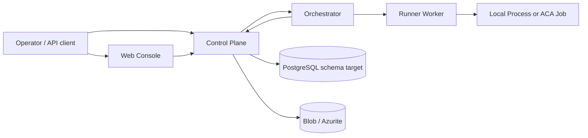
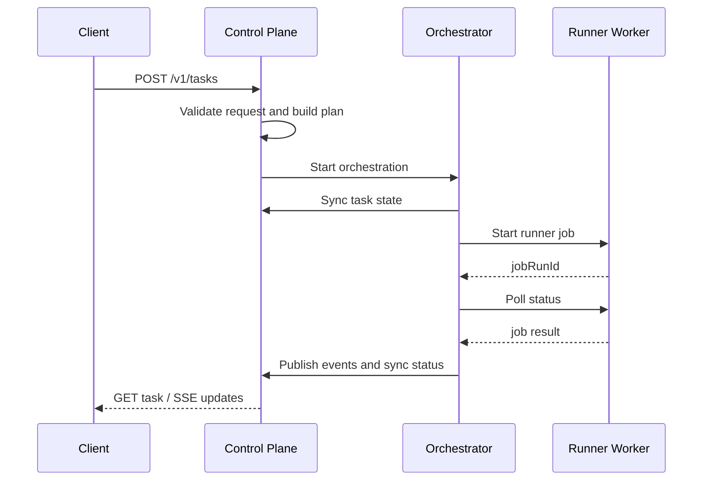
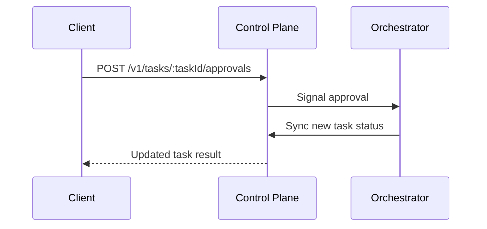

# Architecture

## Overview

`flogo-agent-platform` is organized around four deployable applications and shared packages:

- `control-plane`: public API and current task read-model owner
- `orchestrator`: long-running workflow owner
- `runner-worker`: finite job dispatcher and status API
- `web-console`: operator UI
- shared packages for contracts, Flogo graph logic, tools, prompts, and eval data

The design goal is to keep `flogo.json` as the canonical artifact while providing a path for:

- natural-language task intake,
- planning and policy checks,
- structured validation,
- isolated execution,
- approval gates,
- operator visibility.

## High-level topology

## Service responsibilities

### Control-plane

Implementation:

- [apps/control-plane/src/main.ts](C:/Users/aapicella/dev/flogo-agent-platform/apps/control-plane/src/main.ts)
- [apps/control-plane/src/app.module.ts](C:/Users/aapicella/dev/flogo-agent-platform/apps/control-plane/src/app.module.ts)
- [apps/control-plane/src/modules/agent/orchestration.service.ts](C:/Users/aapicella/dev/flogo-agent-platform/apps/control-plane/src/modules/agent/orchestration.service.ts)

Responsibilities:

- expose the public `/v1` API,
- validate incoming task and approval payloads,
- call the planner to build an execution plan,
- start orchestration instances,
- maintain the current in-memory task read model,
- publish and stream task events,
- expose artifacts and graph inspection endpoints,
- accept internal event and state synchronization from the orchestrator.

Current implementation note:

- The control-plane is the current read-model owner, but it is not yet backed by Postgres at runtime.

### Orchestrator

Implementation:

- [apps/orchestrator/src/functions/task-orchestration.ts](C:/Users/aapicella/dev/flogo-agent-platform/apps/orchestrator/src/functions/task-orchestration.ts)
- [apps/orchestrator/src/dev-server.ts](C:/Users/aapicella/dev/flogo-agent-platform/apps/orchestrator/src/dev-server.ts)
- [apps/orchestrator/src/shared/orchestrator-http.ts](C:/Users/aapicella/dev/flogo-agent-platform/apps/orchestrator/src/shared/orchestrator-http.ts)

Responsibilities:

- own long-running workflow state,
- wait for approvals,
- create runner job specs,
- start and poll runner jobs,
- synchronize task status back into the control-plane,
- publish workflow-driven events into the control-plane.

Current implementation note:

- The repo ships both Durable Functions definitions and a Fastify-based local host.
- The local host is what `pnpm dev` and Docker Compose currently use.

### Runner-worker

Implementation:

- [apps/runner-worker/src/index.ts](C:/Users/aapicella/dev/flogo-agent-platform/apps/runner-worker/src/index.ts)
- [apps/runner-worker/src/services/runner-job.service.ts](C:/Users/aapicella/dev/flogo-agent-platform/apps/runner-worker/src/services/runner-job.service.ts)
- [apps/runner-worker/src/services/runner-executor.service.ts](C:/Users/aapicella/dev/flogo-agent-platform/apps/runner-worker/src/services/runner-executor.service.ts)

Responsibilities:

- expose an internal HTTP API for job start and status lookup,
- normalize job payloads using shared schemas,
- execute jobs in a local process mode today,
- represent the intended Azure Container Apps Job path through job metadata and execution-mode selection,
- generate smoke-test specs for `generate_smoke`.

Current implementation note:

- The actual Azure management-plane calls to start ACA Jobs are not yet implemented.
- The Container Apps execution mode is currently a placeholder adapter that returns normalized results.

### Web console

Implementation:

- [apps/web-console/app/page.tsx](C:/Users/aapicella/dev/flogo-agent-platform/apps/web-console/app/page.tsx)
- [apps/web-console/app/tasks/[taskId]/page.tsx](C:/Users/aapicella/dev/flogo-agent-platform/apps/web-console/app/tasks/[taskId]/page.tsx)

Responsibilities:

- submit tasks,
- inspect task details,
- display approvals, artifacts, and event-stream instructions.

## Shared package responsibilities

### `packages/contracts`

Defines the runtime schemas for:

- task intake and task result shapes,
- approvals,
- task events,
- orchestration start and status objects,
- runner job specs and results,
- smoke-test specs,
- Flogo app graph and validation results.

### `packages/flogo-graph`

Implements:

- `parseFlogoAppDocument`
- `buildAppGraph`
- `validateStructural`
- `validateSemantic`
- `validateMappings`
- `validateDependencies`
- `validateFlogoApp`
- `summarizeAppDiff`

### `packages/tools`

Provides local helper implementations for:

- repo reads, searches, diffs, and writes,
- Flogo app parsing and mutation helpers,
- runner dispatch placeholders,
- smoke-test generation,
- artifact publication helpers.

### `packages/agent`

Implements:

- `ModelClient` abstraction,
- lightweight `PolicyEngine`,
- `TaskPlanner`,
- `OrchestratorAgent`,
- `StaticModelClient`.

### `packages/prompts`

Stores versioned prompt templates for:

- orchestrator,
- builder,
- debugger,
- reviewer,
- policy.

### `packages/evals`

Provides:

- golden task cases for create, update, debug, and review,
- aggregate scoring helpers for eval runs.

## End-to-end workflow

### Task submission flow

### Approval flow

## Workflow stages

The current implementation normalizes all orchestration runs to a shared runner-step sequence:

1. `build`
2. `run`
3. `generate_smoke`
4. `run_smoke`

That sequence is defined in [apps/orchestrator/src/shared/orchestrator-http.ts](C:/Users/aapicella/dev/flogo-agent-platform/apps/orchestrator/src/shared/orchestrator-http.ts).

The planner in [packages/agent/src/index.ts](C:/Users/aapicella/dev/flogo-agent-platform/packages/agent/src/index.ts) is conceptually richer than the current runner-step loop. It reasons in terms of:

- graph parse,
- validation,
- patch/generation,
- build,
- smoke validation.

This is intentional. The plan model is already more expressive than the current execution bridge so the platform can grow into a fuller implementation without replacing the contracts again.

## Validation model

Flogo validation currently includes:

- structural validation,
- semantic validation,
- mapping validation,
- dependency validation.

The validator does not yet execute:

- actual Flogo CLI structural compile checks,
- real dependency installation,
- real runtime endpoint assertions against a running Flogo app binary.

Those are planned by the architecture, but not yet fully implemented in code.

## State model

There are three state layers:

1. Public task result state in the control-plane.
2. Orchestration runtime state in the orchestrator.
3. Runner job state in the runner-worker.

Current behavior:

- The orchestrator is the source of truth for a task while it is executing.
- The control-plane is the source of truth for what operators can read through the public API.
- The runner-worker is the source of truth for the current lifecycle of each job run.

## Persistence model

Intended model:

- PostgreSQL stores task, step, event, approval, artifact, and graph projection records.
- Blob storage stores workspace snapshots, logs, binaries, and reports.

Current model:

- Postgres schema exists, but the runtime path still stores task read models in memory.
- Blob persistence is modeled in URIs and infrastructure but not yet fully wired at runtime.

## Container Apps-first runtime model

### Always-on services

- control-plane
- orchestrator
- runner-worker
- web-console

### Finite execution services

- Azure Container Apps Jobs for the Flogo runner image

### Local substitute

Local development uses:

- Docker Compose for service startup,
- the orchestrator Fastify host rather than the Azure Functions host,
- local process execution in runner-worker.

## Known architectural constraints

- Public task and artifact reads are limited by in-memory storage until Postgres is fully integrated.
- The local orchestrator host and Durable Functions definitions must stay behaviorally aligned.
- Azure deployment is scaffolded around Container Apps and manual jobs, but management-plane automation is not complete.

These constraints are important for anyone extending the platform. The repo is best understood as a concrete MVP scaffold with strong contracts and service boundaries, not as a complete production runtime yet.
