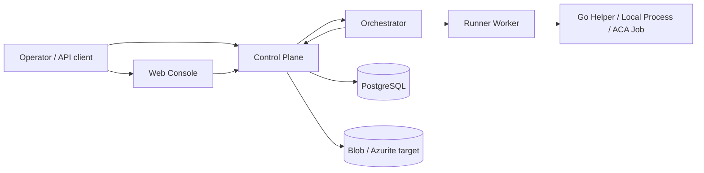
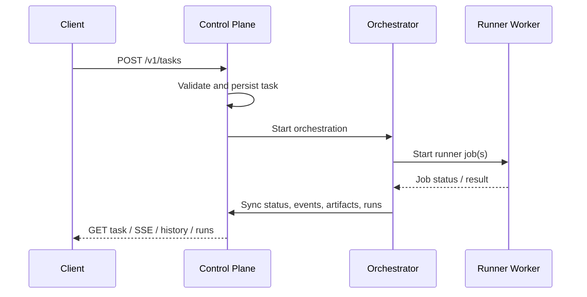
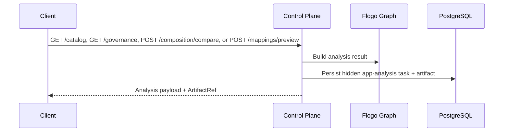
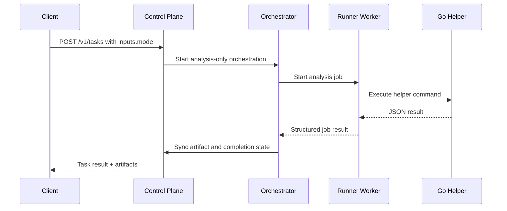

# Architecture

## Overview

`flogo-agent-platform` is organized around four deployable applications plus shared packages and a Go helper binary:

- `control-plane`
- `orchestrator`
- `runner-worker`
- `web-console`
- `go-runtime/flogo-helper`

The platform keeps `flogo.json` as the canonical application artifact while expanding toward a Flogo-native runtime model described in [Flogo-Native Runtime Plan](./flogo-native-runtime-plan.md).

## Architectural stance

### Control plane

The platform remains a modular monolith at the public API layer.

The control-plane owns:

- public REST and SSE endpoints,
- task intake and read models,
- approval APIs,
- direct app-analysis APIs,
- app-analysis Blob/Azurite persistence,
- internal synchronization endpoints,
- Prisma-backed operational persistence.

### Durable orchestration

The orchestrator remains a separate application.

It owns:

- long-running workflow sequencing,
- approval waits,
- runner dispatch,
- orchestration status,
- synchronization back into the control-plane.

### Finite execution

The runner-worker is the only job-dispatch facade.

It owns:

- local-process execution,
- Container Apps Job start/poll behavior,
- job normalization,
- helper command execution,
- smoke-test helper behavior.

### Flogo-native helper path

The Go helper binary exists to bridge into Flogo Core/Flow-native capability without moving the control plane out of TypeScript.

It currently supports:

- flow contract inference,
- subflow extraction and inlining,
- iterator synthesis,
- retry-on-error synthesis,
- doWhile synthesis,
- error-path templates,
- runtime trace capture with narrow recorder-backed runtime helper paths for the supported direct-flow, REST, timer, CLI, and Channel slices, narrow real replay on those same slices, and artifact-backed run comparison with runtime-artifact preference,
- normalized recorder-backed step evidence on those same slices so compare-runs can prefer normalized runtime artifacts when both sides provide them,
- contribution inventory,
- contribution catalog generation,
- descriptor inspection,
- contribution evidence inspection,
- governance validation,
- composition comparison,
- mapping preview,
- mapping tests,
- property planning,
- Go module cache-aware package discovery for contribution evidence,
- descriptor-aware coercion diagnostics.

It is expected to grow into:

- programmatic Core composition,
- broader contribution install/update planning.

The runtime-evidence commands above are still mostly artifact-backed, but direct trace capture now has narrow in-process Core/Flow runtime paths for the existing direct-flow slice, one supported REST trigger-driven slice, a narrow timer startup slice, a narrow CLI command-entry slice, and a narrow Channel internal-event slice. Replay reuses those same supported slices, and run comparison prefers normalized runtime artifacts when both sides provide them, REST envelope comparison when both sides are REST-backed, timer startup comparison when both sides carry timer evidence, and Channel boundary comparison when both sides carry channel evidence. Those narrow slices expose normalized per-step task identity, I/O, and flow-state deltas where observable, the REST slice additionally carries request, mapped flow input/output, and reply evidence in `runtimeEvidence.restTriggerRuntime`, the timer slice carries timer settings plus observed tick evidence in `runtimeEvidence.timerTriggerRuntime`, the CLI slice carries command identity, args, flags, mapped flow input, and reply/stdout evidence in `runtimeEvidence.cliTriggerRuntime`, and the Channel slice carries named-channel data, mapped flow input/output, and evidence metadata in `runtimeEvidence.channelTriggerRuntime`. The helper now also has narrow Phase 4 authoring commands, `contrib scaffold-activity`, `contrib scaffold-action`, `contrib scaffold-trigger`, `contrib validate`, and `contrib package`, which generate descriptor metadata plus Go/module/test/readme files for custom Activity, Action, and Trigger bundles, re-run isolated proof for existing bundles, and emit conservative review archives as persisted artifacts.

## High-level topology

## Service responsibilities

## Control-plane

Implementation:

- `apps/control-plane/src/main.ts`
- `apps/control-plane/src/modules/agent/orchestration.service.ts`
- `apps/control-plane/src/modules/agent/task-store.service.ts`
- `apps/control-plane/src/modules/flogo-apps/flogo-apps.service.ts`
- `apps/control-plane/src/modules/flogo-apps/app-analysis-storage.service.ts`

Responsibilities:

- validate public requests,
- build execution plans,
- start orchestrations,
- store tasks, events, approvals, artifacts, build runs, and test runs through Prisma,
- expose task history and run summaries,
- expose direct app-analysis endpoints for graph, inventory, catalog, descriptor inspection, contribution evidence inspection, governance reporting, composition comparison, artifact listing, and mapping preview,
- expose direct app-analysis endpoints for flow contract inference,
- expose direct flow-refactor endpoints for trigger binding, subflow extraction, subflow inlining, and advanced control-flow synthesis,
- expose direct flow-refactor endpoints for error-path templates,
- expose direct runtime-analysis endpoints for runtime trace capture, replay, and run comparison,
- expose direct app-analysis endpoints for property planning and mapping tests,
- persist app-analysis payload JSON to Blob/Azurite-backed storage,
- accept internal sync callbacks from the orchestrator and runner paths.

Important current behavior:

- task/event/artifact state is persisted in PostgreSQL through Prisma,
- app-scoped analysis artifacts are persisted as hidden analysis task records plus Blob/Azurite-backed JSON payloads,
- example apps can be auto-resolved from `examples/<appId>/flogo.json` and registered into local persistence when needed.

## Orchestrator

Implementation:

- `apps/orchestrator/src/functions/task-orchestration.ts`
- `apps/orchestrator/src/dev-server.ts`
- `apps/orchestrator/src/shared/orchestrator-http.ts`

Responsibilities:

- start and track workflow instances,
- translate tasks into runner steps,
- wait for and react to approval decisions,
- publish task events and sync task state,
- support both standard mutating workflows and analysis-only workflows.

Current workflow modes:

- full create/update/debug/review workflow:
  - `build`
  - `run`
  - `generate_smoke`
  - `run_smoke`
- analysis-only workflow modes:
  - `infer_flow_contracts`
  - `bind_trigger`
  - `extract_subflow`
  - `inline_subflow`
  - `add_iterator`
  - `add_retry_policy`
  - `add_dowhile`
  - `add_error_path`
  - `capture_run_trace`
  - `replay_flow`
  - `run_comparison`
  - `inventory_contribs`
  - `catalog_contribs`
  - `inspect_contrib_evidence`
  - `validate_governance`
  - `compare_composition`
  - `preview_mapping`
  - `test_mapping`
  - `plan_properties`
  - `diagnose_app`
  - `scaffold_activity`
  - `scaffold_action`
  - `scaffold_trigger`
  - `validate_contrib`
  - `package_contrib`

## Runner-worker

Implementation:

- `apps/runner-worker/src/index.ts`
- `apps/runner-worker/src/services/runner-job.service.ts`
- `apps/runner-worker/src/services/runner-executor.service.ts`

Responsibilities:

- expose internal HTTP endpoints for job start and status polling,
- normalize `RunnerJobSpec` requests,
- execute local helper/job commands,
- start and poll Azure Container Apps Jobs in production mode,
- translate command output into structured artifacts and diagnostics.

Current notable behavior:

- local mode executes real helper commands for:
  - `infer_flow_contracts`
  - `bind_trigger`
  - `extract_subflow`
  - `inline_subflow`
  - `add_iterator`
  - `add_retry_policy`
  - `add_dowhile`
  - `add_error_path`
  - `capture_run_trace`
  - `replay_flow`
  - `run_comparison`
  - `inventory_contribs`
  - `catalog_contribs`
  - `inspect_descriptor`
  - `inspect_contrib_evidence`
  - `validate_governance`
  - `compare_composition`
  - `preview_mapping`
  - `test_mapping`
  - `plan_properties`
  - `scaffold_activity`
  - `scaffold_action`
  - `scaffold_trigger`
  - `validate_contrib`
  - `package_contrib`
- Container Apps Job mode includes ARM start/poll logic and job-template routing,
- build/smoke steps are still less Flogo-native than the catalog/preview slice and remain an ongoing implementation area.

## Web console

Implementation:

- `apps/web-console/app/page.tsx`
- `apps/web-console/app/tasks/[taskId]/page.tsx`

Responsibilities:

- task submission,
- task detail viewing,
- runtime evidence inspection for trace, replay, and compare artifacts,
- diagnosis summary inspection,
- approval entry points,
- artifact and event visibility.

Current limitation:

- the operator UI now surfaces the current runtime-evidence artifacts, diagnosis summaries, and minimal contribution-authoring artifact summaries on task detail pages, including shared validation/package outputs, but it is still a thin shell without dedicated catalog, mapping-preview, richer diagnosis drill-down, or a full contribution-authoring workflow.

## Shared package responsibilities

## `packages/contracts`

Defines runtime schemas and TypeScript types for:

- tasks,
- approvals,
- artifacts,
- orchestration requests and status,
- runner job specs/results/status,
- Flogo graphs,
- contribution inventory,
- contribution catalogs and descriptors,
- contribution evidence inspection,
- mapping preview requests and results.
- mapping test requests and results,
- property-plan responses.

## `packages/flogo-graph`

Implements the TypeScript-side Flogo domain model, including:

- app parsing and normalization,
- graph building,
- structural, semantic, mapping, and dependency validation,
- contribution inventory generation,
- contribution catalog generation,
- contribution evidence inspection,
- alias validation,
- governance validation,
- composition comparison,
- mapping classification and preview,
- mapping test execution,
- coercion suggestions,
- deployment-profile-aware property analysis,
- app diff summarization.

## `packages/tools`

Provides capability-oriented tool wrappers for:

- repo access,
- Flogo core/model operations,
- Flogo mapping operations,
- runner dispatch,
- test helpers,
- artifact helpers.

## `packages/agent`

Implements:

- planner logic,
- policy logic,
- model abstraction,
- analysis-only workflow branching,
- execution plan generation.

## `packages/prompts`

Stores prompt templates and versions used by the planner/model layer.

## `packages/evals`

Stores eval fixtures and scoring helpers.

## `go-runtime/flogo-helper`

Implements the current Go-side Flogo-native command surface:

- `flows trace`
- `flows replay`
- `flows compare-runs`
- `flows contracts`
- `triggers bind`
- `flows extract-subflow`
- `flows inline-subflow`
- `flows add-iterator`
- `flows add-retry-policy`
- `flows add-dowhile`
- `flows add-error-path`
- `inventory contribs`
- `catalog contribs`
- `inspect descriptor`
- `evidence inspect`
- `governance validate`
- `compose compare`
- `preview mapping`
- `mapping test`
- `properties plan`
- `contrib scaffold-activity`
- `contrib scaffold-action`
- `contrib scaffold-trigger`
- `contrib validate`
- `contrib package`

## End-to-end runtime flows

## Standard task flow

## Direct app-analysis flow

## Analysis task flow

## Flogo-native capability baseline

The platform has completed the Phase 1 capability area and has implemented Phase 2 design-time flow work plus partial Phase 3 runtime-evidence surfaces:

- contribution inventory,
- contribution cataloging,
- descriptor inspection,
- contribution evidence inspection,
- governance validation,
- composition comparison,
- mapping preview,
- deterministic mapping tests,
- coercion suggestions,
- richer property/environment planning,
- deployment-profile-aware property/environment planning,
- flow contract inference,
- trigger polymorphism,
- subflow extraction and inlining,
- iterator synthesis,
- retry-on-error synthesis,
- doWhile synthesis,
- error-path templates,
- artifact-backed runtime trace capture with a landed recorder-backed direct helper path for the currently supported simple trace scenario,
- artifact-backed replay with a narrow runtime-backed slice for the same supported direct-flow shape,
- artifact-backed run comparison that prefers normalized runtime evidence, REST envelope evidence, timer startup evidence, or Channel boundary evidence when the matching persisted artifacts provide them and recorder-backed evidence otherwise,
- trigger-driven runtime startup is now partially implemented through narrow REST, timer, CLI, and Channel slices on top of the direct-flow helper path,
- analysis-only diagnosis planning can now choose between validation, mapping, contracts, trigger-binding analysis, trace, replay, and compare to produce structured diagnosis reports and recommendation-oriented patch suggestions,
- diagnosis confidence is now explicitly calibrated against runtime-backed, mixed, artifact-backed-only, simulated-fallback, and contract-inference-only proof quality rather than treated as a flat heuristic,
- `packages/evals` now includes a diagnosis-focused regression corpus that exercises planner choice, confidence bands, fallback caveats, and recommendation stability across the current trigger families,
- the web console now exposes task-detail runtime evidence, trigger-specific summaries, normalized steps, fallback reasons, comparison basis, and diagnosis summaries for the currently supported slices,
- the same task-detail artifact surface now exposes minimal Activity/Trigger/Action authoring result summaries, validation summaries, and package summaries, including contribution type, package/module, generated files, build/test status, and package metadata from persisted `contrib_bundle`, `contrib_validation_report`, and `contrib_package` metadata,
- broader runtime coverage beyond the current narrow supported slices remains planned,
- analysis-only orchestration modes.

See [Capability Matrix](./capability-matrix.md) for the detailed breakdown.

## Persistence model

### Current runtime-backed persistence

Persisted through Prisma today:

- tasks,
- task events,
- approvals,
- artifacts,
- build runs,
- test runs.

### Current partial persistence

- app-scoped inventory, catalog, descriptor, contribution-evidence, governance, composition-compare, mapping-preview, property-plan, mapping-test, runtime-trace, replay, and run-comparison artifacts are persisted through hidden synthetic analysis tasks,
- task-scoped `diagnosis_report` artifacts are persisted through the normal task pipeline and can reference nested trace, replay, and comparison artifacts used during diagnosis,
- those app-analysis payloads are stored in Blob/Azurite-backed JSON objects,
- task-scoped `contrib_bundle`, `contrib_validation_report`, `contrib_package`, `build_log`, and `test_report` artifacts from Activity/Trigger/Action authoring are now also uploaded as Blob/Azurite-backed JSON payloads through the same storage seam while retaining Prisma metadata for task/detail rendering,
- broader task artifacts outside the app-analysis and contribution-authoring slices can still include logical/local URIs.

### Planned persistence growth

- blob-backed workspace snapshots,
- richer Flogo graph projections,
- broader runtime/task artifact payload coverage beyond the current app-analysis and contribution-authoring slices.

## Key constraints

- `flogo.json` is still the canonical artifact even as the Go helper path grows.
- The Go helper is intentionally a finite execution binary, not a new always-on service.
- The current helper uses contribution inventory plus module-aware package discovery, evidence confidence, normalized Flogo metadata, static mapping evaluation, and known-registry inference for the Phase 1 analysis path; it is not yet a full Core/Flow-native runtime.
- Runtime trace capture, replay, and run comparison are implemented as helper-backed artifact evidence with narrow live direct-flow, REST, timer, CLI, and Channel slices plus comparison-basis preference over persisted artifacts; diagnosis remains recommendation-oriented, confidence is conservatively calibrated against evidence quality and fallback state, and the platform still does not auto-apply repository patches. Contribution authoring now has a narrow Activity/Trigger/Action scaffold foundation plus shared validate/build/test/package groundwork with blob-backed bundle/proof/package artifacts and minimal task-detail visibility, but install/update flows remain roadmap work.
- In restricted shells on Windows, `next build` and Vitest can fail with `spawn EPERM` even when typecheck is clean.

## Reference documents

- [Flogo-Native Runtime Plan](./flogo-native-runtime-plan.md)
- [Capability Matrix](./capability-matrix.md)
- [API reference](./api-reference.md)
- [Data model](./data-model.md)
