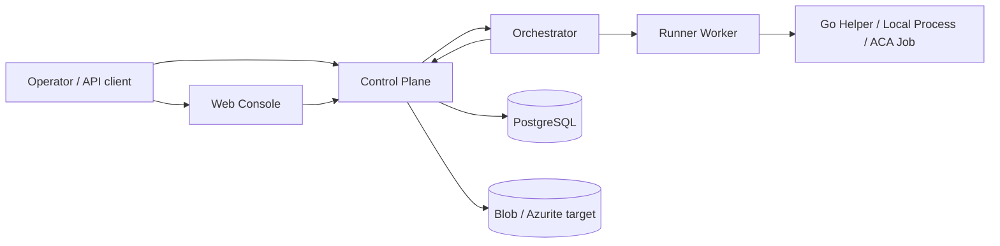
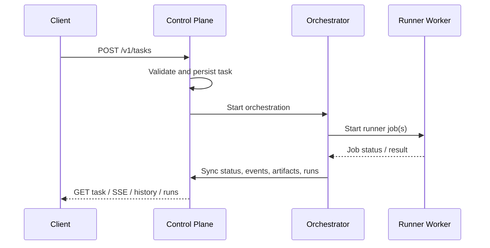
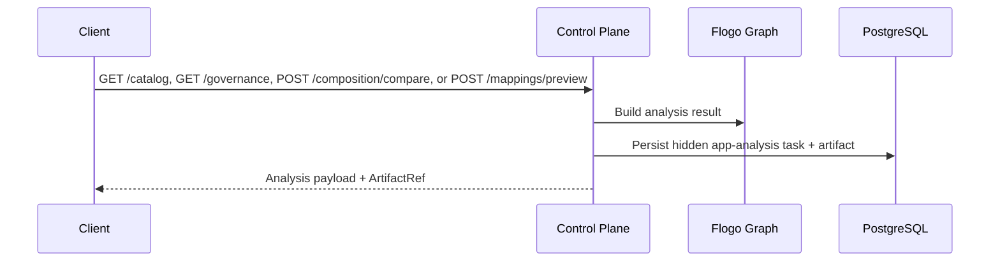
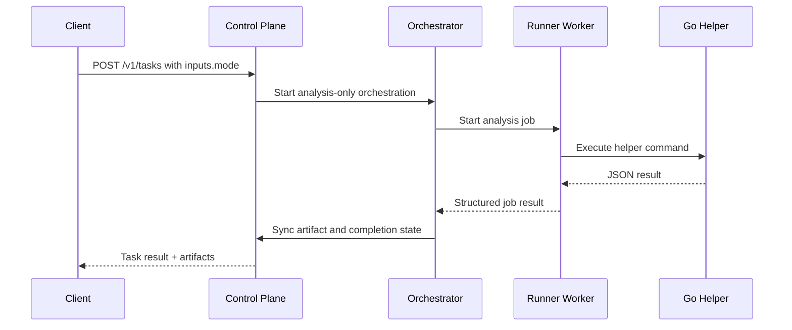

# Architecture

## Overview

`flogo-agent-platform` is organized around four deployable applications plus shared packages and a Go helper binary:

- `control-plane`
- `orchestrator`
- `runner-worker`
- `web-console`
- `go-runtime/flogo-helper`

The platform keeps `flogo.json` as the canonical application artifact while expanding toward a Flogo-native runtime model described in [Flogo-Native Runtime Plan](./flogo-native-runtime-plan.md).

## Architectural stance

### Control plane

The platform remains a modular monolith at the public API layer.

The control-plane owns:

- public REST and SSE endpoints,
- task intake and read models,
- approval APIs,
- direct app-analysis APIs,
- app-analysis Blob/Azurite persistence,
- internal synchronization endpoints,
- Prisma-backed operational persistence.

### Durable orchestration

The orchestrator remains a separate application.

It owns:

- long-running workflow sequencing,
- approval waits,
- runner dispatch,
- orchestration status,
- synchronization back into the control-plane.

### Finite execution

The runner-worker is the only job-dispatch facade.

It owns:

- local-process execution,
- Container Apps Job start/poll behavior,
- job normalization,
- helper command execution,
- smoke-test helper behavior.

### Flogo-native helper path

The Go helper binary exists to bridge into Flogo Core/Flow-native capability without moving the control plane out of TypeScript.

It currently supports:

- contribution inventory,
- contribution catalog generation,
- descriptor inspection,
- governance validation,
- composition comparison,
- mapping preview.

It is expected to grow into:

- programmatic Core composition,
- runtime trace and replay,
- contribution scaffolding and validation.

## High-level topology

## Service responsibilities

## Control-plane

Implementation:

- `apps/control-plane/src/main.ts`
- `apps/control-plane/src/modules/agent/orchestration.service.ts`
- `apps/control-plane/src/modules/agent/task-store.service.ts`
- `apps/control-plane/src/modules/flogo-apps/flogo-apps.service.ts`
- `apps/control-plane/src/modules/flogo-apps/app-analysis-storage.service.ts`

Responsibilities:

- validate public requests,
- build execution plans,
- start orchestrations,
- store tasks, events, approvals, artifacts, build runs, and test runs through Prisma,
- expose task history and run summaries,
- expose direct app-analysis endpoints for graph, inventory, catalog, descriptor inspection, governance reporting, composition comparison, artifact listing, and mapping preview,
- persist app-analysis payload JSON to Blob/Azurite-backed storage,
- accept internal sync callbacks from the orchestrator and runner paths.

Important current behavior:

- task/event/artifact state is persisted in PostgreSQL through Prisma,
- app-scoped analysis artifacts are persisted as hidden analysis task records plus Blob/Azurite-backed JSON payloads,
- example apps can be auto-resolved from `examples/<appId>/flogo.json` and registered into local persistence when needed.

## Orchestrator

Implementation:

- `apps/orchestrator/src/functions/task-orchestration.ts`
- `apps/orchestrator/src/dev-server.ts`
- `apps/orchestrator/src/shared/orchestrator-http.ts`

Responsibilities:

- start and track workflow instances,
- translate tasks into runner steps,
- wait for and react to approval decisions,
- publish task events and sync task state,
- support both standard mutating workflows and analysis-only workflows.

Current workflow modes:

- full create/update/debug/review workflow:
  - `build`
  - `run`
  - `generate_smoke`
  - `run_smoke`
- analysis-only workflow modes:
  - `inventory_contribs`
  - `catalog_contribs`
  - `validate_governance`
  - `compare_composition`
  - `preview_mapping`

## Runner-worker

Implementation:

- `apps/runner-worker/src/index.ts`
- `apps/runner-worker/src/services/runner-job.service.ts`
- `apps/runner-worker/src/services/runner-executor.service.ts`

Responsibilities:

- expose internal HTTP endpoints for job start and status polling,
- normalize `RunnerJobSpec` requests,
- execute local helper/job commands,
- start and poll Azure Container Apps Jobs in production mode,
- translate command output into structured artifacts and diagnostics.

Current notable behavior:

- local mode executes real helper commands for:
  - `inventory_contribs`
  - `catalog_contribs`
  - `inspect_descriptor`
  - `validate_governance`
  - `compare_composition`
  - `preview_mapping`
- Container Apps Job mode includes ARM start/poll logic and job-template routing,
- build/smoke steps are still less Flogo-native than the catalog/preview slice and remain an ongoing implementation area.

## Web console

Implementation:

- `apps/web-console/app/page.tsx`
- `apps/web-console/app/tasks/[taskId]/page.tsx`

Responsibilities:

- task submission,
- task detail viewing,
- approval entry points,
- artifact and event visibility.

Current limitation:

- the operator UI is still a thin shell and does not yet expose dedicated catalog, mapping preview, replay, or contribution-authoring views.

## Shared package responsibilities

## `packages/contracts`

Defines runtime schemas and TypeScript types for:

- tasks,
- approvals,
- artifacts,
- orchestration requests and status,
- runner job specs/results/status,
- Flogo graphs,
- contribution inventory,
- contribution catalogs and descriptors,
- mapping preview requests and results.

## `packages/flogo-graph`

Implements the TypeScript-side Flogo domain model, including:

- app parsing and normalization,
- graph building,
- structural, semantic, mapping, and dependency validation,
- contribution inventory generation,
- contribution catalog generation,
- alias validation,
- governance validation,
- composition comparison,
- mapping classification and preview,
- coercion suggestions,
- property analysis,
- app diff summarization.

## `packages/tools`

Provides capability-oriented tool wrappers for:

- repo access,
- Flogo core/model operations,
- Flogo mapping operations,
- runner dispatch,
- test helpers,
- artifact helpers.

## `packages/agent`

Implements:

- planner logic,
- policy logic,
- model abstraction,
- analysis-only workflow branching,
- execution plan generation.

## `packages/prompts`

Stores prompt templates and versions used by the planner/model layer.

## `packages/evals`

Stores eval fixtures and scoring helpers.

## `go-runtime/flogo-helper`

Implements the current Go-side Flogo-native command surface:

- `catalog contribs`
- `inspect descriptor`
- `governance validate`
- `compose compare`
- `preview mapping`

## End-to-end runtime flows

## Standard task flow

## Direct app-analysis flow

## Analysis task flow

## Flogo-native capability baseline

The platform is currently strongest in the Phase 1 capability area:

- contribution cataloging,
- descriptor inspection,
- governance validation,
- composition comparison,
- mapping preview,
- coercion suggestions,
- richer property/environment planning,
- analysis-only orchestration modes.

See [Capability Matrix](./capability-matrix.md) for the detailed breakdown.

## Persistence model

### Current runtime-backed persistence

Persisted through Prisma today:

- tasks,
- task events,
- approvals,
- artifacts,
- build runs,
- test runs.

### Current partial persistence

- app-scoped inventory, catalog, descriptor, governance, composition-compare, and mapping-preview artifacts are persisted through hidden synthetic analysis tasks,
- those app-analysis payloads are stored in Blob/Azurite-backed JSON objects,
- broader task artifacts outside the app-analysis slice still include logical/local URIs.

### Planned persistence growth

- blob-backed workspace snapshots,
- runtime traces and replay artifacts,
- richer Flogo graph projections,
- contribution bundle artifacts.

## Key constraints

- `flogo.json` is still the canonical artifact even as the Go helper path grows.
- The Go helper is intentionally a finite execution binary, not a new always-on service.
- The current helper uses contribution inventory plus module-aware package discovery, normalized Flogo metadata, and known-registry inference for the Phase 1 analysis path; it is not yet a full Core/Flow-native runtime.
- Flow-aware, runtime-aware, and extension-aware capabilities are still roadmap items.
- In restricted shells on Windows, `next build` and Vitest can fail with `spawn EPERM` even when typecheck is clean.

## Reference documents

- [Flogo-Native Runtime Plan](./flogo-native-runtime-plan.md)
- [Capability Matrix](./capability-matrix.md)
- [API reference](./api-reference.md)
- [Data model](./data-model.md)
