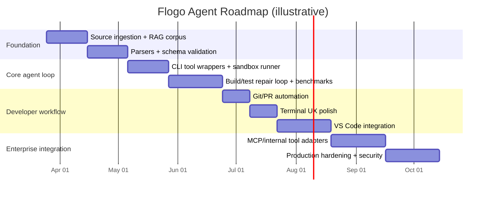

# Building an LLM-Powered Terminal Agent for TIBCO Flogo

## Executive summary

This report proposes a rigorous, test-driven plan to build an LLM-powered terminal agent (similar in workflow to Claude/Codex-style coding agents) specialized for **TIBCO Flogo** development: creating, debugging, maintaining, and testing Flogo apps reliably using **official documentation** and **official/maintainer GitHub repositories** as primary sources. The core technical approach is **tool-augmented RAG** (retrieval-augmented generation with deterministic tool execution) rather than “prompt-only” generation, because Flogo work must be grounded in concrete artifacts: `flogo.json` descriptors, flow DSL JSON, Flogo CLI commands, unit-test artifacts (e.g., `.flogotest`), and build/test outputs. citeturn17search4turn12search5turn18search2turn1view6

At the center of the design is a **Flogo-aware compiler loop**:

1) the agent reads/edits Flogo artifacts (especially `flogo.json` and embedded flow DSL),  
2) validates them against **Flogo’s JSON schema** and known semantic checks,  
3) generates/updates a runnable Flogo project using the Flogo CLI (`flogo create`, `flogo build`, dependency install/update),  
4) executes automated tests via Flogo’s CLI-driven flow tester / unit-test commands, and  
5) iterates with a **minimal-diff repair strategy** until build+tests pass. citeturn17search4turn10search7turn18search2turn1view6turn12search18

Where enterprise environments or “internal tools” are required (e.g., deployment metadata, Control Plane workflows, org-specific connectors), the agent should not hardcode integrations. Instead, it should use a **tool-interface layer** that can be implemented as: (a) direct CLI wrappers, (b) REST API connectors, and/or (c) **MCP** (Model Context Protocol) servers that expose internal capabilities as typed tools/resources. This is aligned with MCP’s goal of standardizing connectivity between LLM apps and external tools/data sources. citeturn14search2turn14search10turn14search14turn18search14

Because constraints (team size, budget, compute, security posture, target runtime) are unspecified, this plan includes explicit assumptions; it also provides option tables comparing LLM choices, RAG vs fine-tuning, and sandboxing strategies, plus a milestone timeline and measurable success criteria.

## Project goals, scope, success criteria, and assumptions

### Goals

The product goal is an agent that can act as a **reliable Flogo co-developer** in a terminal-first workflow:

- Understand and manipulate the **Flogo application descriptor** (`flogo.json`) and its schemas/constraints (structure and required fields), grounded in the upstream schema definition. citeturn1view6turn12search18  
- Understand and manipulate **Flogo flows** as a **JSON-based DSL** (tasks/links/etc.) and correctly wire triggers → actions → flows. citeturn8view1turn12search18  
- Correctly handle **flow input/output parameters** and **mappings** (expressions, literals, objects) so that generated flows are semantically valid and testable. citeturn6search24turn6search11turn1view5  
- Reliably automate the end-to-end lifecycle: create project → install dependencies → build → run tests → produce PRs. citeturn17search4turn12search18turn14search1turn14search14  
- Integrate with enterprise workflows (e.g., deployment, Control Plane, internal services) through a pluggable tool layer (MCP/CLI/API). citeturn14search2turn12search10turn8view4  

### Scope boundaries

To avoid “agent sprawl,” define what is explicitly **in** and **out** of scope for v1:

In scope (v1):
- `flogo.json` creation/editing and validation against schema. citeturn1view6turn12search18  
- Flogo CLI operations: `create`, `build`, `install`, `list`, `imports`, `update`, plus CLI plugins where helpful. citeturn17search4turn9search2  
- Flow testing from CLI/executable: list flows, generate test data, run tests from JSON, run unit tests from `.flogotest`. citeturn10search7turn18search2turn10search9  
- Repo ops through Git + GitHub CLI/API. citeturn14search1turn14search0turn14search13  

Out of scope (v1, unless specifically required):
- Full fidelity UI automation of Flogo Web UI (browser control), except possibly via supported APIs/MCP. (This is risky and brittle compared to CLI/API grounding.) citeturn8view0turn14search14  
- “Magic” build of every possible TIBCO Cloud Integration app variant. The public API documentation explicitly states constraints in building app executables (e.g., some triggers/connectors are unsupported for building an executable). citeturn17search0turn19search0  

### Success criteria

Define success as measurable outcomes in CI, not “the agent seems smart”:

1) **Build success rate**: On a curated benchmark of Flogo apps, agent changes must yield a successful `flogo build` (or equivalent build path) without human intervention ≥ 90% of the time. citeturn17search4turn12search18  
2) **Test pass rate**: For apps with unit tests, agent changes must keep all tests passing (or fix failing tests) ≥ 85% on first attempt, ≥ 95% within 3 repair iterations. citeturn18search2turn10search9  
3) **Schema and semantic correctness**: 100% of agent-authored `flogo.json` must validate against the Flogo app schema; additionally, the agent must run Flogo’s own diagnostics (e.g., orphaned refs list) when applicable. citeturn1view6turn17search4  
4) **Provenance**: For any non-trivial generated choice (e.g., mapping pattern, trigger setting), the agent must cite the documentation snippet(s) or repo file(s) that support the change (in-product provenance, not just “trust me”). citeturn6search11turn6search24turn17search4  
5) **Safety/regression**: The agent must never push secrets, must avoid destructive repo actions by default, and must support safe rollback (git revert/reset + “known-good build”). citeturn14search1turn14search0  

### Assumptions (explicit)

Because constraints are unspecified, this plan assumes:
- A small product team (2–6 engineers) and a moderate pilot timeframe (≈ 3–6 months for a production-ready v1).  
- Access to at least one isolated build environment capable of running Go builds and Flogo tooling, plus containerization or VM isolation for sandboxing. citeturn17search4turn15search1turn14search3  
- Permission to clone/scan the relevant official repositories and to index internal docs/tools (if any) into a private retrieval system. citeturn9search0turn8view2turn8view0turn8view4  
- If a “required references list” exists beyond what was visible in the prompt, it was not included in the conversation; this report therefore prioritizes official public docs and the repositories surfaced here (and is designed to be extended once that list is supplied). citeturn9search0turn8view4turn12search5  

## Functional requirements and developer experience

### Functional capabilities

A specialized Flogo agent needs capabilities spanning code generation, debugging, testing, and repo operations. The key is to define them as **tool-invokable actions** with deterministic outputs.

#### Code and configuration generation

The agent must generate and modify:
- `flogo.json` app descriptors and embedded flow resources, consistent with examples and with the schema’s required keys (`name`, `type`, `version`, `description`, `imports`, `properties`, `channels`, `triggers`, `resources`, `actions`). citeturn1view6turn12search18  
- Flows as JSON DSL (`tasks`, `links`, etc.) and use correct mapping syntax (literal vs expression vs object) depending on context. citeturn8view1turn6search11  
- Trigger-to-flow wiring: handlers map to actions and reference flows via `flowURI` (e.g., `res://flow:<id>` patterns) consistent with Flogo descriptor examples. citeturn12search18turn1view5  
- Extension scaffolding guidance (when building custom activities/triggers/connectors): descriptor-driven model plus Go runtime code and optional TypeScript UI layer, as documented in extension-building guides. citeturn18search5turn0search9turn19search32  

#### Debugging and diagnosis

The agent must:
- Perform **static validation** (JSON schema validation, plus semantic checks like “orphaned refs”). The Flogo CLI includes an orphaned refs listing capability. citeturn17search4turn1view6  
- Perform **runtime/debug workflows** using supported mechanisms:
  - Run executables and capture engine logs (common Flogo engine start and trigger start logs appear in tutorials and can be used as recognition patterns). citeturn16search16turn16search1  
  - Use flow test tooling (list flows, generate test data, run tests) when available. citeturn10search7turn10search9  
- Provide causal explanations that connect errors to specific JSON locations and to the relevant documentation or schema elements. citeturn1view6turn6search11  

#### Testing and evaluation workflows

The agent must support two distinct but complementary testing modes:

1) **Executable-level flow testing (Flow Tester / test command)**:  
   Official docs describe testing via the app executable using a `test` command, including capabilities like listing flows, generating test data, testing with JSON input, and outputting results. citeturn10search7turn10search9  

2) **Unit testing via `.flogotest`**:  
   Official docs describe `--test` execution using a `.flogotest` file and specifying test suites and output directories. citeturn18search2turn10search9  

Additionally, because many Flogo extensions/runtime components are Go-based, the agent should run Go unit tests for extension code where relevant, consistent with extension guidance that encourages Go tests (`*_test.go`). citeturn18search5turn10search6  

#### Repo operations and collaboration

The agent must:
- Create branches, commit changes, and open pull requests (PRs) with structured descriptions and test evidence. citeturn14search1turn14search9  
- Support GitHub automation via either GitHub API endpoints for PRs (when integrating into CI systems) or via GitHub CLI for developer terminals. citeturn14search0turn14search13turn14search8  
- Be permissions-aware: PR creation requires appropriate write access and may trigger rate limiting; agent must throttle and batch PR/issue updates. citeturn14search0  

#### CLI integration and app lifecycle management

The agent must orchestrate:
- Project bootstrapping: `flogo create -f <json>` and dependency install/update flows. citeturn17search4turn12search18  
- Build options: `flogo build` with flags such as embedding config and optimizing builds. citeturn17search4  
- Plugins: install and use CLI plugins when architecture requires custom commands. citeturn9search2turn17search4  

For enterprise runtime workflows, the agent should also support TIBCO Cloud Integration API workflows where applicable:
- Building a Flogo app executable via API, including stated considerations and restrictions. citeturn17search0  

### Developer UX requirements

A practical “terminal agent” for Flogo should ship with at least two developer-facing shells:

1) **Terminal-first interactive agent**:
- A chat-like REPL that can (a) read repository context, (b) propose a plan, (c) show diffs before applying, and (d) run a build+test loop and present results with citations/provenance.  
- This mirrors common coding-agent workflows; modern agentic tools emphasize permission control and safe action selection (e.g., “auto mode” vs requiring confirmations). citeturn7news38turn14search14  

2) **IDE integration (VS Code)**:
- TIBCO positions its VS Code extension as a way to design, build, and test Flogo apps locally within VS Code. The hub repository explicitly frames Flogo as integrated into VS Code. citeturn8view4turn18search14  
- Therefore, the agent should be able to run as:
  - a VS Code extension side panel (chat + actions + diffs), and/or  
  - a local service with VS Code UI binding (webview) that invokes the same tool APIs.

A third integration option (later milestone) is a **visual flow editor bridge**:
- Because flows are represented as JSON DSL and app descriptors embed flow resources, the agent can operate on the DSL and let the UI render it. citeturn8view1turn12search18  
- The key UX requirement is “round-trippability”: edits made by the agent should stay compatible with visual designers, and edits made visually should remain compatible with agent parsing/validation. citeturn8view0turn1view6  

## Architecture and design choices

### Architecture overview

The recommended architecture is a multi-layer “agentic compiler pipeline”:

- **Frontend**: terminal UI + VS Code UI  
- **Agent core**: planning, tool routing, memory, and guardrails  
- **Flogo intelligence layer**: parsers, schema validators, mapping/IO semantics, contribution metadata index  
- **Toolchain**: wrappers around Flogo CLIs, test runners, Git/GitHub operations, (optional) TIBCO Cloud APIs  
- **Sandbox**: isolated execution for builds/tests and for running generated binaries

Key Flogo primitives the system must model:
- Flogo apps are event-driven; triggers feed actions/flows; flows are function-like with input/output parameters and mappings. citeturn10search22turn6search24turn6search11  
- Flogo apps are commonly authored as `flogo.json` (and can be created manually or via UI), then compiled into binaries. citeturn12search18turn17search4  

### Mermaid architecture diagram

```mermaid
flowchart LR
  U[Developer in terminal / VS Code] --> UI[Agent UI: chat + commands + diffs]
  UI --> AC[Agent Core: plan, decide, cite]
  AC --> RAG[Retriever: official docs + repos]
  AC --> FI[Flogo Intelligence Layer]
  FI --> V[Schema + semantic validators]
  FI --> P[Parsers: flogo.json + flow DSL + contributions]
  AC --> TOOLS[Tool Router]

  TOOLS --> FCLI[Flogo CLI wrapper: create/build/install/list/update]
  TOOLS --> FTST[Flow tester / unit test runner]
  TOOLS --> GIT[Git + GitHub ops]
  TOOLS --> TCI[TIBCO Cloud API / Control plane CLIs (optional)]

  FCLI --> SBX[Execution Sandbox]
  FTST --> SBX
  SBX --> OUT[Logs, artifacts, test results]
  OUT --> AC
  RAG --> AC
  V --> AC
  GIT --> PR[PR / patches / change summary]
```

This structure is designed so the LLM is never the “source of truth” for Flogo mechanics; the source of truth is the **official docs + schemas + tool outputs**. citeturn1view6turn17search4turn10search7turn14search14  

### LLM selection options

Your model choice determines cost, latency, reasoning quality, and deployment constraints. For this use case, the model must excel at: tool use, long-context code understanding, structured output, and high precision under iterative repair loops.

#### LLM options table (illustrative shortlist)

| Option | Strengths for this project | Main risks / gaps | When to choose |
|---|---|---|---|
| entity["company","OpenAI","api provider"] “gpt-5.4” class models | Explicitly recommended for complex reasoning/coding in official model docs; broad tool support ecosystem; strong coding performance. citeturn7search6turn7search0 | Vendor lock-in; cost controls needed; must implement strict guardrails around tool execution. | Default “best quality” cloud option for first production pilot. citeturn7search6turn14search14 |
| entity["company","Anthropic","ai company"] Claude 4.6 family | Official release notes highlight improvements across coding, long-context reasoning, and agent planning; large context windows. citeturn7search4turn7search7turn7search1 | Similar vendor lock-in; must align tool APIs; permission/autonomy control is a product-design requirement. citeturn7news38turn14search14 | Strong choice if you want deep codebase navigation and long-context workflows. citeturn7search7turn7search4 |
| entity["company","Google DeepMind","ai lab"] Gemini 3.1 Pro class models | Official model cards emphasize multimodal reasoning and large-context repository comprehension; official API docs provide model lifecycle notices. citeturn7search15turn7search19turn7search25 | Ecosystem differences; operational maturity depends on your infra; ensure stable API versioning. citeturn7search19 | If you need strong multimodal + long-context across code repos and docs. citeturn7search15 |
| entity["company","Meta","ai company"] Llama 4 class open(-weight) models | Open(-weight) options can run on-prem and reduce data-exfiltration risk; official Meta posts describe Llama 4 variants. citeturn7search2turn7search5 | You own serving, safety, and regression control; quality may be lower than top proprietary models for complex agentic loops (depends on deployment). | If data residency and on-prem operation are primary requirements. citeturn7search2turn7search5 |

This table is intentionally not exhaustive; the project should implement a **model-agnostic interface** so you can A/B test models and swap providers without redesigning tooling. citeturn7search6turn7search1turn7search19  

### RAG vs fine-tuning

For “understand Flogo fully,” the key question is: should we fine-tune the base model on Flogo content, or rely on retrieval + tooling?

#### Design comparison table: RAG vs fine-tune

| Approach | What it does best | What it struggles with | Recommendation for this project |
|---|---|---|---|
| Retrieval-Augmented Generation (RAG) + tools | Keeps answers grounded in up-to-date docs and repo state; supports provenance; aligns with tools-first workflows (build/test outputs as truth). citeturn14search2turn14search14turn17search4turn1view6 | Requires high-quality chunking and retrieval; needs careful prompt/tool design to avoid hallucinated “facts.” | **Primary approach** for v1. Flogo evolves and internal tools vary; retrieval keeps you current and auditable. citeturn14search2turn17search0turn8view4 |
| Fine-tuning (supervised) | Can improve pattern consistency for Flogo JSON edits, error repair heuristics, and house style. | Risk of overfitting to older versions; harder to enforce provenance; may encode mistakes; requires good labeled datasets. | Use **only after** you have a stable evaluation suite and logs from real usage; keep it “thin” (format/strategy tuning). |
| Hybrid: RAG + small fine-tune | Combines grounded knowledge with improved behavior. | More complex MLOps; must prevent tuned model from ignoring retrieved sources. | Best long-term if you can support continuous evaluation and re-training. |

MCP-style tool integration is complementary: MCP standardizes how the agent calls tools and accesses context; RAG handles knowledge grounding; fine-tuning shapes behavior. citeturn14search2turn14search10turn14search14turn14search34  

### Flogo parsers and validators

A reliable Flogo agent must operate on **structured representations**, not raw text edits.

Minimum parser/validator set:

- JSON parser for `flogo.json` and for embedded flow definitions. citeturn12search18turn8view1  
- JSON Schema validation against Flogo’s schema definition (`project-flogo/core/schema.json`) to catch structural errors early. citeturn1view6turn0search6  
- Semantic validator layer for:
  - `imports` ↔ `ref` consistency (detect alias usage and orphaned refs). citeturn17search4  
  - flowURI references exist and match resources (`res://flow:<id>` patterns). citeturn12search18turn1view5  
  - mapping correctness: expressions begin with `=`; references like `$flow.*`, `$env.*` appear in mapping docs and must be used in proper scope. citeturn6search11turn6search24  

Where enterprise artifacts exist (e.g., app specs, deployment manifests, context files), treat them as additional schemas and extend the validator set; this is exactly where “internal tools” become pluggable validators rather than opaque steps. citeturn8view4turn17search0turn14search2  

### Execution sandbox choices

Because the agent will run builds, execute binaries, and potentially invoke networked connectors, sandboxing is a core reliability and safety requirement.

#### Sandboxing strategies table

| Sandbox strategy | Isolation strength | Performance / complexity | Fit for Flogo agent |
|---|---|---|---|
| Containers (runC) + seccomp | Moderate; depends on kernel boundary; seccomp reduces syscall surface but is “not a sandbox” by itself. citeturn15search3turn15search6 | Fast, common; easier CI integration. | Good for internal trusted codebases; add extra controls for untrusted PRs and external connectors. citeturn15search6 |
| gVisor sandboxed containers | Stronger isolation via an application kernel; explicitly designed to run untrusted containers/apps more safely. citeturn14search3turn14search15 | Some compatibility/perf tradeoffs; operational overhead. | Recommended baseline for running agent tools against untrusted inputs. citeturn14search3turn14search15 |
| Firecracker microVMs | Strong isolation with lightweight virtualization; designed for secure multi-tenant services; microVMs combine VM isolation with container-like speed. citeturn15search1turn15search15turn15search18 | Higher complexity; requires KVM; more infra setup. | Best for high-risk environments (untrusted code, strict separation), and for running compiled executables safely. citeturn15search1turn15search15 |
| Kata Containers (microVM pods) | VM-based isolation integrated into container orchestration; used for sandboxed container runtimes. citeturn15search19turn15search2 | More moving parts; integrates well with Kubernetes RuntimeClass. citeturn15search2 | Good if your enterprise already standardizes on Kubernetes sandboxed runtimes. citeturn15search2 |

Recommendation: start with **gVisor** for local/CI sandboxing (balanced security+complexity) and keep an option to upgrade select workloads (unknown code, external contributions) to **Firecracker/Kata** depending on threat model. citeturn14search15turn15search1turn15search19  

## Data sources, knowledge ingestion, and learning plan

### Primary sources to prioritize (official docs + official repos)

The agent’s knowledge base should be built from:

- Official open-source docs and tutorials:
  - Project Flogo documentation pages, especially CLI command reference (build/create/install/list/update) and flow/mapping/IO parameter docs. citeturn17search4turn6search11turn6search24turn10search22  
- Official schemas and code:
  - Flogo app descriptor JSON schema in `project-flogo/core/schema.json`. citeturn1view6turn0search6  
  - `project-flogo/cli` repository and docs. citeturn9search0turn17search4  
  - `project-flogo/flow` repository (flow DSL examples). citeturn8view1turn6search2  
  - `project-flogo/contrib` repository (activities/triggers/functions lists and install patterns). citeturn8view2turn6search1  
  - `project-flogo/flogo-web` repository (for UI integration points and environment setup hints). citeturn8view0turn6search13  
- Official TIBCO/Cloud Software Group docs accessible via integration.cloud:
  - Creating Flogo apps in TIBCO Cloud Integration. citeturn12search5  
  - Flow testing and unit test commands (`--test`, `.flogotest`, output files). citeturn10search7turn18search2turn10search9  
  - Building app executables via TIBCO Cloud Integration API, and its restrictions/considerations. citeturn17search0  
- Official “hub” and SDK/sample repositories:
  - The official hub repo describing VS Code integration and providing samples (including MCP examples). citeturn8view4turn11search1  
  - TCI Flogo SDK / samples repository. citeturn12search13turn11search7  

These sources collectively cover: app structure, CLI workflows, flow DSL, mappings, IO params, testing, extension development, and enterprise workflows. citeturn12search18turn17search4turn18search2turn18search5turn8view4  

### Retrieval design: chunking and indexing strategy

A Flogo-specific RAG system should index content in a way that matches the developer’s tasks:

- Command reference chunks keyed by verb/noun: “flogo build flags”, “flogo list orphaned”, “plugin install”. citeturn17search4turn9search2  
- Schema chunks keyed by JSON paths: `properties.triggers.items`, `definitions.trigger.Config`, etc., to support “point fixes” on schema errors. citeturn1view6  
- Flow DSL chunks keyed by “tasks/links”, mapping syntax, IO parameters, and Flow Params “function” mental model. citeturn8view1turn6search24turn6search11  
- Testing chunks keyed by: “list flows”, “generate test data”, “.flogotest”, “--output-dir”, “--test-suites”. citeturn10search7turn18search2  
- Extension chunks keyed by: `descriptor.json` fields, Go runtime conventions, and optional UI TypeScript rules. citeturn18search5turn0search9  

### Fine-tuning plan (optional and staged)

If you choose to fine-tune, treat it as an optimization layer after you have telemetry:

1) Collect anonymized interaction logs: tool calls, diffs, schema errors, build errors, repair iterations, final outcomes.  
2) Build a labeled dataset of “error → minimal fix” pairs, especially for:
   - orphaned refs resolution,  
   - invalid mappings (missing `=` or wrong scope),  
   - missing required keys per schema,  
   - incorrect trigger/flowURI wiring. citeturn17search4turn6search11turn1view6turn12search18  
3) Fine-tune only on *behavioral patterns* (structured patch generation, correct tool order), while continuing to rely on RAG for factual grounding.  

“Train on your outcomes, retrieve your facts” is the safest pattern for systems that must remain up-to-date and auditable. citeturn14search2turn14search34  

## Prompting strategy, system messages, and tool protocols

### Prompt engineering principles for this use case

A Flogo agent needs prompts that emphasize:

- **Artifact-first reasoning**: prefer reading and validating `flogo.json` and flow resources before proposing changes. citeturn12search18turn1view6  
- **Tool-first execution**: whenever possible, call `flogo` CLI and test commands to verify rather than “reasoning-only.” citeturn17search4turn10search7turn18search2  
- **Provenance**: include citations/links (or in-product equivalent) for any important decision, especially around mappings and testing commands. citeturn6search11turn10search9turn14search14  
- **Minimal diffs**: prefer smallest patch that resolves a validated error, then re-run validation/build/test.  

### System message template (conceptual)

The system instructions for the agent should encode non-negotiables:

- Never invent Flogo keys/flags; verify via schema/CLI docs. citeturn1view6turn17search4  
- Any change to `flogo.json` must pass JSON schema validation. citeturn1view6  
- Before proposing a change, read current repo state; before finalizing, run build + appropriate tests. citeturn17search4turn18search2turn10search7  
- Do not execute destructive operations (force-push, delete branches, delete contexts) unless explicitly requested; require confirmation for operations that affect remote systems or production. (This aligns with modern “agent autonomy” safety patterns.) citeturn7news38turn14search14turn14search0  

### Tool protocol design (typed tools)

Define tools with strict inputs/outputs. Example tool categories:

- `flogo.create(project_name, flogo_json_path, core_version?)` citeturn17search4turn12search18  
- `flogo.build(embed=true, optimize=false, shim?)` citeturn17search4  
- `flogo.install(pkg, replace?)` and `flogo.update(pkg@version)` citeturn17search4turn8view2  
- `flogo.list(filter?, orphaned?, json=true)` citeturn17search4  
- `flowtest.list_flows(executable)` / `flowtest.generate_data(executable, flow)` / `flowtest.run(executable, input_json, output_file?)` citeturn10search7  
- `unit_test.run(executable, app_json?, flogotest_file, suites?, output_dir?)` citeturn18search2turn10search9  
- `git.diff`, `git.commit`, `gh.pr_create`, `gh.pr_comment` citeturn14search1turn14search5turn14search9  

For internal tools, expose them the same way—preferably via MCP so they appear as typed tools and resources. citeturn14search2turn14search10turn8view4  

## CI/CD, automated testing, evaluation metrics, and guardrails

### CI/CD pipeline design

Minimum CI pipeline stages:

- **Static checks**:
  - JSON schema validation of `flogo.json` using the official schema. citeturn1view6  
  - Semantic checks: orphaned refs, missing imports, invalid flowURI. citeturn17search4turn12search18  

- **Build checks**:
  - `flogo create` + `flogo build` (with `-e/--embed` when required by deployment model). citeturn12search18turn17search4  

- **Test checks**:
  - If `.flogotest` exists: execute unit tests via the documented `--test` command and archive `.testresult` outputs. citeturn18search2  
  - If executable-level flow tests are used: run flow tester commands (list flows, run tests, compare results). citeturn10search7  
  - For extension code: run `go test` for Go runtime components. citeturn18search5turn10search6  

- **Packaging/deployment**:
  - Where applicable, build executables via the TIBCO Cloud API or other enterprise deployment workflows; respect stated build limitations. citeturn17search0turn19search0  

### Example test cases (Flogo-specific)

A strong evaluation suite should include both golden-path and failure-path cases.

1) **Mapping correctness test**  
   - Create a flow that maps trigger inputs into flow params using expression mappings and validates outputs. Mapping docs require expressions start with `=` and can reference `$flow` and `$env`. citeturn6search11turn6search24  

2) **IO params decoupling test**  
   - Verify that a flow’s declared input/output parameters remain consistent even when switching triggers, reflecting the “flow as function” model. citeturn6search24turn12search18  

3) **Orphaned ref regression test**  
   - Introduce a broken alias ref (e.g., `ref:"#log"` without matching import) and ensure the agent detects and repairs it using `flogo list --orphaned`. citeturn17search4turn8view2  

4) **Flow tester unit execution**  
   - Export or create a `.flogotest` file and run unit tests with `--test-file`, optionally limiting suites. Validate a `.testresult` is produced. citeturn18search2turn10search9  

5) **Enterprise API build constraints test**  
   - Include a benchmark app that uses a disallowed feature for building an executable and verify the agent flags the limitation and recommends alternatives. The TIBCO Cloud API docs list features that prevent executable build. citeturn17search0turn19search0  

### Evaluation metrics

Track metrics at three levels:

- **Task success**:
  - build success, test success, time-to-green, number of repair loops. citeturn17search4turn18search2  

- **Quality of change**:
  - diff size (lines changed), number of files touched, config drift (unexpected changes).  

- **Reliability and grounding**:
  - citation coverage (percent of actions w/ doc grounding), schema validation pass rate, reproducibility (rerun CI yields same results). citeturn1view6turn14search14  

### Safety and reliability guardrails

A Flogo agent is effectively a build/test automation system with code-writing powers. Guardrails must be concrete:

- **Validation gates**:  
  - Schema validation before any build step. citeturn1view6  
  - Tool-based checks before any PR. citeturn17search4turn18search2  

- **Rollback and change control**:
  - Every run produces a patch series; rollback is a git revert/reset to last green commit, plus rebuild verification. citeturn14search9turn14search1  

- **Explainability and provenance**:
  - Each “fix” must include: (a) which validator/test failed, (b) which doc/schema rule applies, and (c) what minimal change resolves it. citeturn1view6turn6search11turn18search2  

- **Connector and secret hygiene**:
  - Never print or store secrets; avoid embedding credentials into `flogo.json`; use environment variables or secret stores per enterprise practice. (Where official docs are inaccessible, enforce general best practice.) citeturn6search11turn12search16  

- **Sandbox enforcement**:
  - Run “untrusted” changes (e.g., third-party contributions) in gVisor/microVM sandboxes; treat syscalls/network egress as policy-controlled. citeturn14search3turn14search15turn15search1turn15search3  

## Implementation roadmap, milestones, infrastructure, deliverables, and risks

### Milestone timeline (high-level)

The timeline below assumes a small team and iterative delivery. Adjust durations based on staffing and security constraints.

#### Milestone table

| Milestone | Deliverable | Key acceptance tests |
|---|---|---|
| Inception and source grounding | Indexed RAG corpus from official docs/repos; baseline tool runners | Retrieve+cite correct CLI flags; schema validation working. citeturn17search4turn1view6 |
| Flogo artifact intelligence | Parsers + schema validation + semantic checks | Detect orphaned refs; validate `flogo.json` required fields. citeturn17search4turn1view6 |
| Build/test automation loop | `flogo create/build` and flow/unit test execution in sandbox | Green build+tests on benchmark apps; `.testresult` produced. citeturn12search18turn18search2turn10search7 |
| Repo ops integration | Git+PR automation and evidence generation | PR includes diffs + CI logs; permissions-aware PR creation. citeturn14search1turn14search0 |
| VS Code UX integration | VS Code extension (or plugin) integrating chat + actions | Open repo, run agent, apply patch, run tests in IDE. citeturn8view4turn18search14 |
| Enterprise tool adapters | MCP and/or API adapters for internal tools/Control Plane | Tools discoverable as typed capabilities; audited calls. citeturn14search2turn14search10turn8view4 |
| Hardening and scale | Load tests, multi-repo support, stronger sandboxing | gVisor/microVM policies enforced; reproducible builds. citeturn14search15turn15search1 |

### Mermaid timeline diagram



### Infrastructure and permissions required

Infrastructure:
- A build environment with Go toolchain and Flogo CLI installation (`go install github.com/project-flogo/cli/...@latest`). citeturn10search2turn17search4  
- A sandbox runtime (gVisor recommended baseline) and an artifact store for logs/test outputs. citeturn14search15turn14search3  
- A document index + vector store for RAG, with ACL support for internal documents. citeturn14search2turn14search10  

Permissions:
- Read access to required repositories; write access for PR creation (or a bot account), consistent with GitHub PR requirements. citeturn14search0turn14search1  
- Access to TIBCO Cloud Integration APIs if you plan to build executables via API; those APIs require OAuth tokens and enforce role requirements. citeturn17search0  

### Deliverables and artifacts

Engineering deliverables:
- Agent service (local daemon) + terminal client.  
- VS Code extension or integration package aligned with Flogo’s VS Code-centric workflow. citeturn8view4turn18search14  
- Tool adapters:
  - Flogo CLI adapter implementing documented commands and flags. citeturn17search4  
  - Flow/unit test adapter implementing `--test` and flow tester operations. citeturn10search7turn18search2  
  - Git/GitHub adapter (CLI and/or REST). citeturn14search1turn14search0  
- Flogo schema and semantic validator library. citeturn1view6turn17search4  
- Benchmark suite + CI pipelines + evaluation dashboards.

Operational artifacts:
- Security policy for sandbox execution and network egress. citeturn14search15turn15search3  
- Provenance and audit logging for tool calls and applied patches (especially for internal tools via MCP). citeturn14search2turn14search10turn14search18  

### Risk assessment and mitigations

**Risk: Hallucinated Flogo structure or invalid mappings**  
Mitigation: enforce schema validation against the upstream schema; run semantic checks; maintain a library of mapping rules grounded in mapping docs (literal vs expression `=`; scope `$flow`, `$env`). citeturn1view6turn6search11turn6search24  

**Risk: Tool output brittleness and version drift**  
Mitigation: pin tool versions in CI; include “tool version capture” step and regression tests; leverage official docs for flags and behaviors. citeturn17search4turn10search9turn7search6  

**Risk: Enterprise build limitations (feature incompatibility)**  
Mitigation: encode constraints from official API/build documentation into a rules engine; fail fast with recommended alternatives. citeturn17search0turn19search0  

**Risk: Unsafe execution of generated binaries or untrusted contributions**  
Mitigation: sandbox builds/tests; prefer gVisor or microVM isolation for untrusted changes; restrict syscall surface and network egress. citeturn14search3turn14search15turn15search1turn15search6  

**Risk: Over-automation of repo actions**  
Mitigation: permission tiers (read-only, patch-only, PR-only, merge-capable); conservative defaults; require explicit consent for destructive actions; follow best practices for PR creation. citeturn7news38turn14search9turn14search0  

**Risk: Incomplete “required references list” coverage**  
Mitigation: keep ingestion pipeline modular; accept additional reference sources and rebuild the index; track coverage metrics (what % of answers cite required sources). citeturn14search2turn14search10